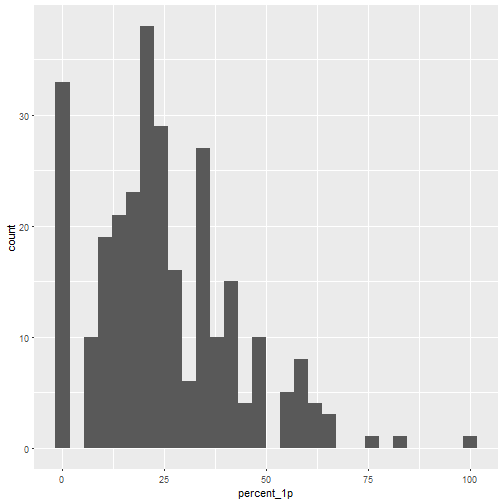

# Yleisiä tilastoja

Kaiken kaikkiaan teksteistä voidaan antaa seuraavat yleiset tiedot:

* Tekstejä ylipäätään: 492
* Tekstejä, joissa ei käsitellä asumista  ollenkaan: 75
* Tekstejä, joissa 1 kpl asumista: 284
* Tekstejä, joissa 2 kpl asumista: 81
* Tekstejä, joissa 3 kpl asumista: 29
* Tekstejä, joissa enemmän kuin 3 kpl asumista: 23
* Asumista käsitteleviä kappaleita yhteensä: 643

# Ajatuksia siitä, minkä analysointi olisi mielekästä

Mikä olisi metodologisesti mielekäs lähestymistapa, jos miettii, että
tarkoituksena olisi esimerkiksi *löytää x erilaista tapaa rakentaa
kappale(kappaleet) asumisesta*?

Tässä jotain siitä, mitä itselleni on tullut mieleen.


## Ensimmäisen (ja viimeisen?) virkkeen tutkiminen

Sanotaan, ettei suomessa ole tarkkaa konventiota sille, että kappaleen alussa 
tai ylipäätään jossain kohden kappaletta pitäisi olla *topic sentence* (topiikkivirke?).
Mitä eri tapoja sitten ihmiset käyttävät aloittaessaan asumisesta kertovaa kappaletta?

###  Asumisen mainitseminen

Yksi ajatus olisi tarkastella sitä, esitelläänkö ensimmäisessä virkkeessä asumista ja millä tavalla.
Tätä  varten laadin lyhyen listan sanoista (joko verbejä tai substantiiveja), jotka liittyvät asumiseen:

asua, asunto, asuminen, asumis#järjestely, kämppä, majoittua, majoittaa, majoittuminen, majoitus, asuntola, asun#tola, vuokrataso, vuokra#taso, vuora#sopimus, vuorasopimus, huone, asuin#paikka, solu#huone, asukas, asu#kas, vuokra 

Nopea tilasto näistä:


|Asuminen ilmaistu | Frekvenssi|
|:-----------------|----------:|
|None              |         57|
|dobj              |         54|
|nmod:gobj         |         27|
|nsubj             |         24|
|nmod              |         22|
|root;nmod         |         22|
|nmod:poss         |         21|
|root              |         19|
|nsubj:cop         |         14|
|dobj;nmod         |         12|
|dobj;dobj         |          8|
|nmod;dobj         |          8|
|xcomp;nmod        |          7|
|root;dobj         |          6|
|root;nmod;nmod    |          6|


# Tilastoja pääverbeistä


Katsotaan yleisesti jotakin, mitä pääverbeistä voisi saada irti.
Jos otetaan

* tekstistä riippumatta kaikki kappaleet, jossa käsitellään asumista, 
* näistä kappaleista jokainen virke erikseen
* virkkeestä irti se, mikä on virkkeen ROOT-elementti

saadaan tulokseksi, että 20 suosituinta verbiä ovat:


|Lemma      | Frekvenssi|
|:----------|----------:|
|olla       |       1578|
|asua       |        239|
|saada      |        187|
|kannattaa  |        175|
|maksaa     |        114|
|suositella |        114|
|löytää     |         88|
|tulla      |         74|
|sijaita    |         71|
|löytyä     |         68|
|käydä      |         66|
|ei         |         63|
|jakaa      |         53|
|hankkia    |         39|
|päästä     |         38|
|hakea      |         33|
|tarjota    |         33|
|tehdä      |         33|
|ottaa      |         32|
|vuokrata   |         32|

Tämä ei tietysti vielä ole millään tavalla hyödyllistä, mutta antaa
jonkinlaista yleiskuvaa siitä, että samat verbit todella kiertävät teksteissä.

Periaatteessa pääverbejä voisi eritellä luokkiin, niin että luokkia olisivat 
esimerkiksi *staattiset verbit*, *evaluoivat verbit* yms., jolloin näistä voisi 
saada jotakin mielekkäämpää aikaan.


Pohditaan seuraavaksi sitä, mihin kohtaan kappaletta yleensä sijoittuvat 
ensimmäisessä persoonassa esiintyvät verbit, mihin kohtaan toisessa ja niin edelleen.


```
## `stat_bin()` using `bins = 30`. Pick better value with `binwidth`.
```



